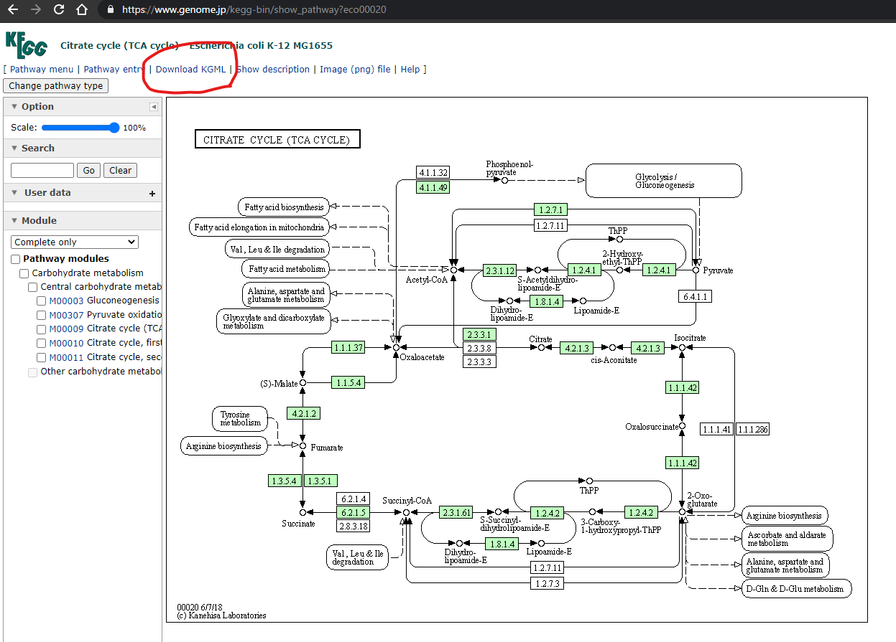

# KEGGscape

**KEGGscape** is a Cytoscape App for importing KGML(KEGG pathway XML).

**KEGGscape** is formerly known as [KGMLReader](https://github.com/idekerlab/kgmlreader/tree/2.x)

If you use **KEGGscape** in your research, please cite:

* [KEGGscape: a Cytoscape app for pathway data integration](http://www.ncbi.nlm.nih.gov/pmc/articles/PMC4141640/). Nishida K, Ono K, Kanaya S, Takahashi K. F1000Res. 2014 Jul 1;3:144. doi: 10.12688/f1000research.4524.1. eCollection 2014.

## Quick Start

1. Install **KEGGscape** with Cytoscape app manager. 
2. Get a kgml file. For example, to get the kgml of E.coli TCA cycle pathway (**eco00020**), open https://www.genome.jp/kegg-bin/show_pathway?eco00020 with web browser and click the **Download KGML** link 
3. Click the "**Import Network from File System**" icon in Cytoscape, select the eco00020.xml file, and click the open button. 

That's all. Now you should see 

## Introduction
[Cytoscape](http://www.cytoscape.org/) is a de-facto standard bioinformatics software platform for integrating, analyzing, and visualizing biological network data.
__*KEGGscape*__ is a [Cytoscape App](http://apps.cytoscape.org/apps/keggscape) to import KEGG Pathway data to Cytoscape.
KEGGscape users can use powerful Cytoscape core features to visualize additional (experimental) data sets on top of KEGG pathways.

### About KEGG

[KEGG Pathway database](http://www.genome.jp/kegg/pathway.html) is one of the most comprehensive databases of human-curated biological pathways.
[KGML (KEGG Markup Language)](http://www.kegg.jp/kegg/xml/) is the file format to represent KEGG Pathway data files in XML.
KEGGscape uses those KGML files as its source of pathway data.

## Tutorials
 - [Quick start guide](https://github.com/idekerlab/KEGGscape/wiki/Quick-Start-Guide)
 - [Transcriptome visualization](https://github.com/idekerlab/KEGGscape/wiki/How-to-duplicate-the-process-in-F1000research-article)
 - [Metabolome visualization](https://github.com/idekerlab/KEGGscape/wiki/Visualizing-Time-Series-Metabolome-Profiles)

## Goals
* Full support for [KEGG Pathway](http://www.genome.jp/kegg/pathway.html), including signaling pathways.
* ~~On-demand access to [KEGG RESTful API](http://www.kegg.jp/kegg/rest/keggapi.html) to add extra annotations for the pathways.~~ (Due to the restriction of KEGG API, we stopped supporting KEGG API. For more information, please check https://www.kegg.jp/kegg/rest/#main:~:text=Restriction .)
* ~~Annotation by [KEGG MEDICUS database](http://www.kegg.jp/kegg/rest/keggapi2.html)~~ (Due to the restriction of KEGG API, we stopped supporting KEGG API. For more information, please check https://www.kegg.jp/kegg/rest/#main:~:text=Restriction .)
* Merging multiple pathways in a same network view.

## Design & Development
* Kozo Nishida (Riken, Japan)
* Keiichiro Ono (Cytoscape Consortium / UC, San Diego, USA)

## Questions?
Please send them to [cytoscape-helpdesk](https://groups.google.com/forum/#!forum/cytoscape-helpdesk).
