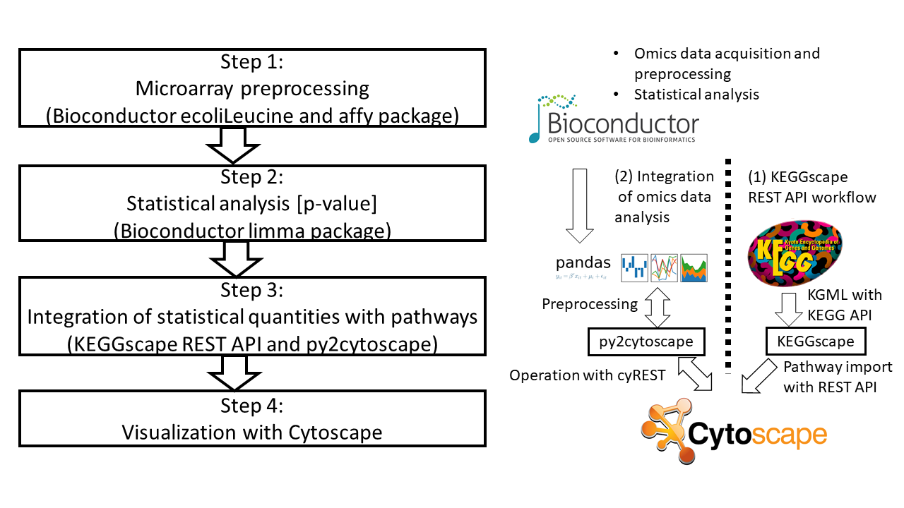

```{r setup, include=FALSE}
knitr::opts_chunk$set(echo = TRUE)
```

## Prerequisites

You will need:

- Cytoscape 3.6.1 or greater, which can be downloaded from http://www.cytoscape.org/download.php. Simply follow the installation instructions on screen.
- KEGGscape 0.8.0 or greater, which can be instelled from Cytoscape App Manager.


In the following workflow, it is necessary for Cytoscape to be running on the PC that executes RMarkdown.
First make sure that Cytoscape which installed KEGGscape is up.

## Note about this RMarkdown
This RMarkdown uses **Python3**, and needs R "reticulate" package.
Please run
```{r}
install.packages("reticulate")
```
in your R shell before running this RMarkdown.
And add the path to Python to your PATH environment variable (on Windows).


## Overview

The following image represents KEGGscape REST API workflow combining with the py2cytoscape package. The left panel shows
our workflow of the gene expression analysis to the KEGGscape visualization. The right panel represents how
omics data and pathway information are actually merged in the workflow.



## Step 0 (Installing dependent packages)
First of all we install the R and Python packages for this workflow.

### Installing R packages

```{r}
source("https://bioconductor.org/biocLite.R")

biocLite("ecoliLeucine")
biocLite("affy")
biocLite("limma")
```

### Installing Python packages

#### Mac or Linux

```{python}
import os
os.system('python -m pip install py2cytoscape requests pandas')
```

#### Windows

Windows users need to download and install the python-igraph whl from [Christoph’s site](http://www.lfd.uci.edu/~gohlke/pythonlibs/#python-igraph).
Please install python-igraph before you install py2cytoscape, otherwise pip will try to **build** python-igraph (and will fail). 

```
python -m pip install ".\python_igraph-0.7.1.post6-cp36-cp36m-win_amd64.whl"
python -m pip install py2cytoscape
```

## Step 1 (Microarray preprocessing)
We use bioconductor **ecoliLeucine and affy** packages for the dataset preprocessing of this workflow.

```{r}
library(ecoliLeucine)
library(affy)

data(ecoliLeucine)
eset <- rma(ecoliLeucine)
pData(eset)
```

## Step 2 (Statistical analysis)

We use bioconductor **limma** package to calculate the statistical quantities like fold change ratio between two E. coli strains and the adjusted p-values for probe set information.

```{r}
library(limma)
strain <- c("lrp-","lrp-","lrp-","lrp-","lrp+","lrp+","lrp+","lrp+")
design <- model.matrix(~factor(strain))
colnames(design) <- c("lrp-","lrp+vs-")
design

fit <- lmFit(eset, design)
fit <- eBayes(fit)
options(digits=2)
result <- topTable(fit, coef = 2, number = 40, adjust.method = "BH")
result
write.csv(result, file = "result.csv")
```

## Step 3 (Integration of statistical quantities with pathways)

### Importing all Escherichia coli K-12 MG1655 KEGG pathways with KEGGscape REST API

This code chunk automates batch pathway import. 

```{python}
import requests
import pandas as pd
from io import StringIO

r = requests.get('http://rest.kegg.jp/list/pathway/eco')
ecopathways = pd.read_table(StringIO(r.text), header=None)
for pathid in ecopathways[0]:
    requests.get('http://localhost:1234/keggscape/v1/' + pathid[5:])
```

The following image is the schematic illustration.


KEGGscape REST API uses KEGG API.
Academic users are permitted to use the KEGG API for individual downloads. KEGG FTP subscription and
license agreement are, however, required for non-academic usage (http://www.kegg.jp/kegg/legal.
html).


### Importing the limma result table with py2cytoscape

Here we integrate the limma statistical quantities with the E. coli (K-12 MG1655) KEGG pathway.
We use Python pandas package (https://pandas.pydata.org) to integrate each quantities and probe sets into enzyme nodes of KEGG pathway. If there exists multiple probe set for the one KEGG enzyme node, then average of the statistical quantities would be embedded into the node.
If none of the statistics are integrated in the enzyme node in the pathway, the pathway has been removed from cytoscape.


```{python}
import pandas as pd
# Preprocessing
limma = pd.read_csv("./result.csv", index_col=0)
new_index = limma.index.str.extract('(b[0-9]{4})', expand=None)
limma = limma.set_index(new_index)
limma = limma[limma.index.notna()]

# Merging with Cytoscape node table
from py2cytoscape.data.cyrest_client import CyRestClient
cy = CyRestClient()
all_suid = cy.network.get_all()

for i in all_suid:
    net = cy.network.create(i)
    table = net.get_node_table()
    keggids = table['KEGG_ID']
    genes = keggids.str.extractall('(b[0-9]{4})')
    table4cy = pd.merge(genes, limma, left_on=0, right_index=True)
    if(table4cy.shape[0] != 0):
        meantable4cy = table4cy.groupby('SUID').mean()
        net.update_node_table(df=meantable4cy, network_key_col='SUID')
    else:
        cy.network.delete(net)
```

## Step 4 (Visualization with Cytoscape)

This code chunk automates Cytoscape VizMap GUI operation.
Here we highlight the KEGG enzyme node with integrated limma statistics in red.
Finally we save all the network visualization result in svg images.

```{python}
from py2cytoscape.data.cyrest_client import CyRestClient
from py2cytoscape.data.style import StyleUtil
import pandas as pd
# Preprocessing
limma = pd.read_csv("./result.csv", index_col=0)
new_index = limma.index.str.extract('(b[0-9]{4})', expand=None)
limma = limma.set_index(new_index)
limma = limma[limma.index.notna()]

cy = CyRestClient()

# Vizual mapping
my_kegg_style = cy.style.create('KEGG Style')
color_gradient = StyleUtil.create_2_color_gradient(min=limma['adj.P.Val'].min(), max=limma['adj.P.Val'].max(), colors=('red', 'white'))
my_kegg_style.create_continuous_mapping(column='adj.P.Val', vp='NODE_FILL_COLOR', col_type='Double', points=color_gradient)

# Saving all networks as images
all_suid = cy.network.get_all()
for i in all_suid:
    net = cy.network.create(i)
    path = net.get_network_table()['KEGG_PATHWAY_ID']
    pathid = path.values[0][5:]
    file = open(pathid + ".svg", 'wb')
    file.write(net.get_svg())
    file.close()
```
